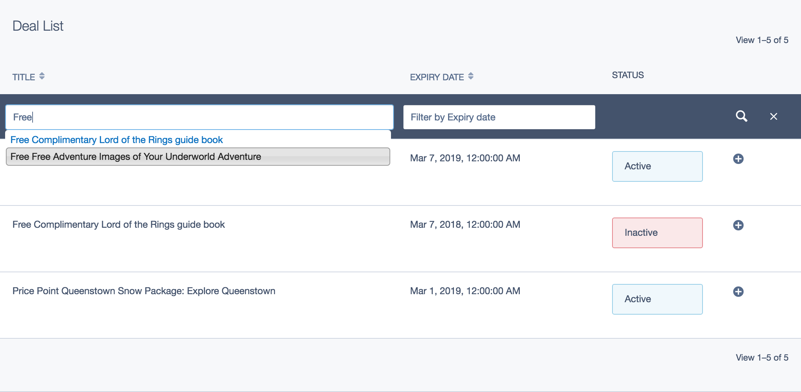
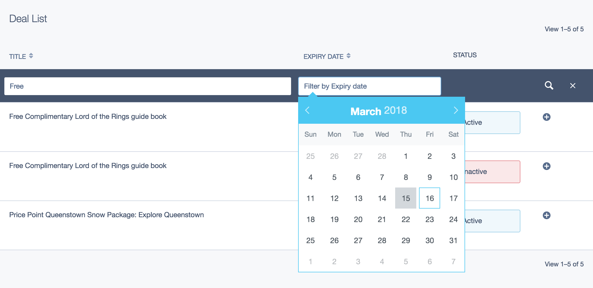
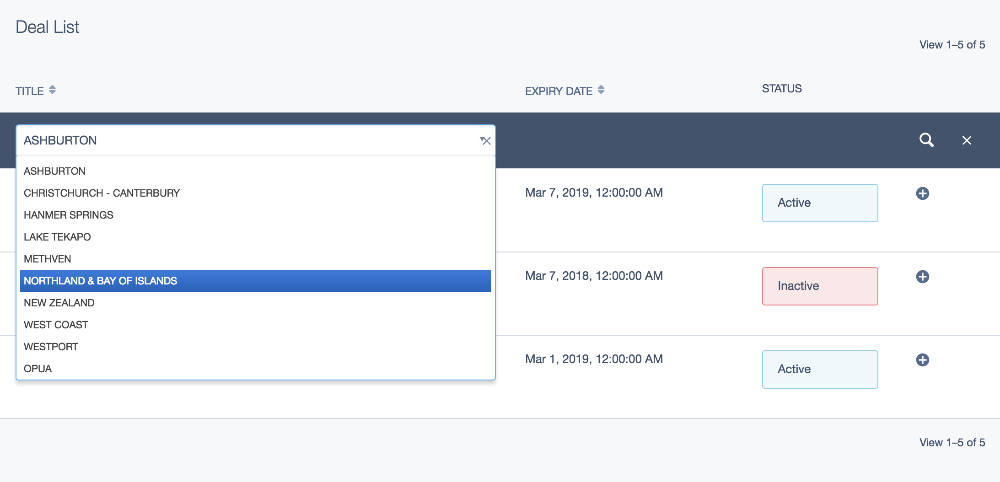
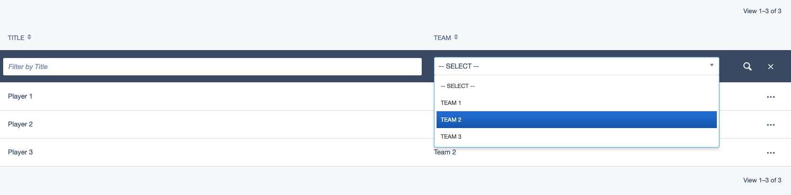

# GridField rich filter header

This `GridField` component is intended to replace the default `GridFieldFilterHeader` component and provide rich functionality not available in the original.

Here is a brief comparison of these components:

`GridFieldFilterHeader` (original component)

* no filter related configuration available
* filtering only works if `GridField` column name matches `DB` column name, which is not the case in many situations (date fromatting, column content getter function)
* `TextField` is always used as a filter input `FormField`
* `PartialMatchFilter` is always used for filtering
* filtering is always applied to the DB field of respective `GridField` column
* it's not possible to NOT display a filter

`RichFilterHeader` (component in this module)

* filters are fully configurable
* you can specify the mapping between `GridField` column name and `DB` column name so you can freely use features like date fromatting, column content getter function
* you can choose to use any `FormField` in your filters, `TextField` is used only as a default
* `FormFields` which use XHR like `AutoCompleteField` are supported as well
* any `SearchFilter` can be used, `PartialMatchFilter` is used only as a default
* you can filter based on any data by specifying your own filter method

Overall this module allows you to fully customise your `GridField` filters including rare edge cases and special requirements.

## Requirements

* table header component needs to be present in the `GridField` (for example `GridFieldSortableHeader`)
* the last column of the table needs to have a vacant header cell so the filter widget could be displayed there
* for example you can't have the last column with sorting header widget and filter widget at the same time

## Installation

`composer require silverstripe-terraformers/gridfield-rich-filter-header dev-master`

## Basic configuration

Full filter configuration format looks like this:

```
'GridField_column_name' => [
    'title' => 'DB_column_name',
    'filter' => 'search_filter_type',
],
```

Concrete example:

```
'Expires.Nice' => [
    'title' => 'Expires',
    'filter' => 'ExactMatchFilter',
],
```

`search_filter_type` can be any `SearchFilter`, see search filter documentation for more information

https://docs.silverstripe.org/en/4/developer_guides/model/searchfilters/

Shorter configuration formats are available as well:

Field mapping version doesn't include filter specification and will use `PartialMatchFilter`.
This should be used if you are happy with using `PartialMatchFilter`

```
'GridField_column_name' => 'DB_column_name',
```

Whitelist version doesn't include filter specification nor field mapping.
This configuration will use `PartialMatchFilter` and will assume that both `GridField_column_name` and `DB_column_name` are the same.

```
'GridField_column_name',
```

Multiple filters configuration example:

```
$gridFieldConfig->removeComponentsByType(GridFieldFilterHeader::class);

$filter = new RichFilterHeader();
$filter
    ->setFilterConfig([
        'getFancyTitle' => 'Title',
        'Expires.Nice' => [
            'title' => 'Expires',
            'filter' => 'ExactMatchFilter',
        ],
    ]);


$gridFieldConfig->addComponent($filter, GridFieldPaginator::class);
```

If no configuration is provided via `setFilterConfig` method, filter configuration will fall back to `searchable_fields` of the `DataObject` that is listed in the `GridField`.
If `searchable_fields` configuration is not available, `summary_fields` will be used instead.

Make sure you add the `RichFilterHeader` component BEFORE the `GridFieldPaginator`
otherwise your paginaton will be broken since you always want to filter before paginating.

## Field configuration

Any `FormField` can be used for filtering. You just need to add it to filter configuration like this:

```
->setFilterFields([
    'Expires' => DateField::create('', ''),
])
```

`Name` of the field can be left empty as it is populated automatically.
I recommend to leave the `title` empty as well as you probably don't need to display it as it is redundant to `GridField` column header title in most cases.

## Filter methods

This configuration covers most edge cases and special requirements where standard `SearchFilter` is not enough.
If filter method is specified for a field, it will override the standard filter.
Filter method is a callback which will be applied to the `DataList` and you are free to add any functionality you need
inside the callback. Make sure that your callback returns a `DataList` with the same `DataClass` as the original.

```
->setFilterMethods([
    'Title' => function (DataList $list, $name, $value) {
        // my custom filter logic is implemented here
        return $filteredList;
    },
])
```

Note that `$name` will have the value of `DB_column_name` from your config.

For your convenience there are couple of filter methods available to cover some cases.

* `AllKeywordsFilter` - will split the text input by space into keywords and will search for records that contains ALL keywords
* `ManyManyRelationFilter` - will search for records that have relation to a specific record via `many_many` relation

Both of these filters can be used in `setFilterMethods` like this:

```
->setFilterMethods([
    'Title' => RichFilterHeader::FILTER_ALL_KEYWORDS,
])
```

## Additional examples

### Example #1

* filter with `AutoCompleteField` and filtering by `AllKeywordsFilter` filter method
* filter with `DateField` and filtering by `StartsWithFilter`

```
$gridFieldConfig->removeComponentsByType(GridFieldFilterHeader::class);

$filter = new RichFilterHeader();
$filter
    ->setFilterConfig([
        'Label',
        'DisplayDateEnd.Nice' => [
            'title' => 'DisplayDateEnd',
            'filter' => 'StartsWithFilter',
        ],
    ])
    ->setFilterFields([
        'Label' => $dealsLookup = AutoCompleteField::create('', ''),
        'DisplayDateEnd' => DateField::create('', ''),
    ])
    ->setFilterMethods([
        'Label' => RichFilterHeader::FILTER_ALL_KEYWORDS,
    ]);
    
$dealsLookup
    ->setSourceClass(SystemDeal::class)
    ->setSourceFields(['Label'])
    ->setDisplayField('Label')
    ->setLabelField('Label')
    ->setStoredField('Label')
    ->setSourceSort('Label ASC')
    ->setRequireSelection(false);
    
$gridFieldConfig->addComponent($filter, GridFieldPaginator::class);
```




### Example #2

* filter with `DropdownField` and filtering with `ManyManyRelationFilter`

Note that the items that are listed in the `GridField` have a `many_many` relation with `TaxonomyTerm` called `TaxonomyTerms`

```
$gridFieldConfig->removeComponentsByType(GridFieldFilterHeader::class);

$filter = new RichFilterHeader();
$filter
    ->setFilterConfig([
        'Label' => 'TaxonomyTerms',
    ])
    ->setFilterFields([
        'TaxonomyTerms' => DropdownField::create(
            '',
            '',
            TaxonomyTerm::get()->sort('Name', 'ASC')->map('ID', 'Name')
        ),
    ])
    ->setFilterMethods([
        'TaxonomyTerms' => RichFilterHeader::FILTER_MANY_MANY_RELATION,
    ]);
    
$gridFieldConfig->addComponent($filter, GridFieldPaginator::class);
```



### Example #3

* filter with `TextField` (with custom placeholder text) and custom filter method

Our custom filter method filters records by three different `DB` columns via `PartialMatch` filter.

```
$gridFieldConfig->removeComponentsByType(GridFieldFilterHeader::class);

$filter = new RichFilterHeader();
$filter
    ->setFilterConfig([
        'Label',
    ])
    ->setFilterFields([
        'Label' => $label = TextField::create('', ''),
    ])
    ->setFilterMethods([
        'Label' => function (DataList $list, $name, $value) {
            return $list->filterAny([
                'Label:PartialMatch' => $value,
                'TitleLineOne:PartialMatch' => $value,
                'TitleLineTwo:PartialMatch' => $value,
            ]);
        },
    ]);

$label->setAttribute('placeholder', 'Filter by three different columns');
$gridFieldConfig->addComponent($filter, GridFieldPaginator::class);
```

### Example #4

* full code example on setup for `has_one` relation using a `DropdownField`

This example covers
* `Player` (has one `Team`)
* `Team` (has many `Player`)
* `PlayersAdmin`

```
<?php

namespace App\Models;

use SilverStripe\ORM\DataObject;
use SilverStripe\ORM\HasManyList;

/**
 * Class Team
 *
 * @property string $Title
 * @method HasManyList|Player[] Players()
 * @package App\Models
 */
class Team extends DataObject
{
    /**
     * @var string
     */
    private static $table_name = 'Team';

    /**
     * @var array
     */
    private static $db = [
        'Title' => 'Varchar',
    ];

    /**
     * @var array
     */
    private static $has_many = [
        'Players' => Player::class,
    ];
}
```

```
<?php

namespace App\Models;

use SilverStripe\ORM\DataObject;

/**
 * Class Player
 *
 * @property string $Title
 * @property int $TeamID
 * @method Team Team()
 * @package App\Models
 */
class Player extends DataObject
{
    /**
     * @var string
     */
    private static $table_name = 'Player';

    /**
     * @var array
     */
    private static $db = [
        'Title' => 'Varchar',
    ];

    /**
     * @var array
     */
    private static $has_one = [
        'Team' => Team::class,
    ];

    /**
     * @var array
     */
    private static $summary_fields = [
        'Title',
        'Team.Title' => 'Team',
    ];
}
```

```
<?php

namespace App\Admin;

use App\Models\Player;
use App\Models\Team;
use SilverStripe\Admin\ModelAdmin;
use SilverStripe\Forms\DropdownField;
use SilverStripe\Forms\FieldList;
use SilverStripe\Forms\Form;
use SilverStripe\Forms\GridField\GridField;
use SilverStripe\Forms\GridField\GridFieldFilterHeader;
use SilverStripe\Forms\GridField\GridFieldPaginator;
use Terraformers\RichFilterHeader\Form\GridField\RichFilterHeader;

/**
 * Class PlayersAdmin
 *
 * @package App\Admin
 */
class PlayersAdmin extends ModelAdmin
{
    /**
     * @var array
     */
    private static $managed_models = [
        Player::class => ['title' => 'Players'],
    ];

    /**
     * @var string
     */
    private static $menu_title = 'Players';

    /**
     * @var string
     */
    private static $url_segment = 'players';

    /**
     * @param mixed|null $id
     * @param FieldList|null $fields
     * @return Form
     */
    public function getEditForm($id = null, $fields = null): Form
    {
        $form = parent::getEditForm($id, $fields);

        /** @var GridField $gridField */
        $gridField = $form->Fields()->fieldByName('App-Models-Player');

        if ($gridField) {
            // Default sort order
            $config = $gridField->getConfig();

            // custom filters
            $config->removeComponentsByType(GridFieldFilterHeader::class);

            $filter = new RichFilterHeader();
            $filter
                ->setFilterConfig([
                    'Title',
                    'Team.Title' => [
                        'title' => 'TeamID',
                        'filter' => 'ExactMatchFilter',
                    ],
                ])
                ->setFilterFields([
                    'TeamID' => $team = DropdownField::create(
                        '',
                        '',
                        Team::get()->sort('Title', 'ASC')->map('ID', 'Title')
                    ),
                ]);


            $team->setEmptyString('-- select --');
            $config->addComponent($filter, GridFieldPaginator::class);
        }

        return $form;
    }
}
```

We can now filter players by teams.


